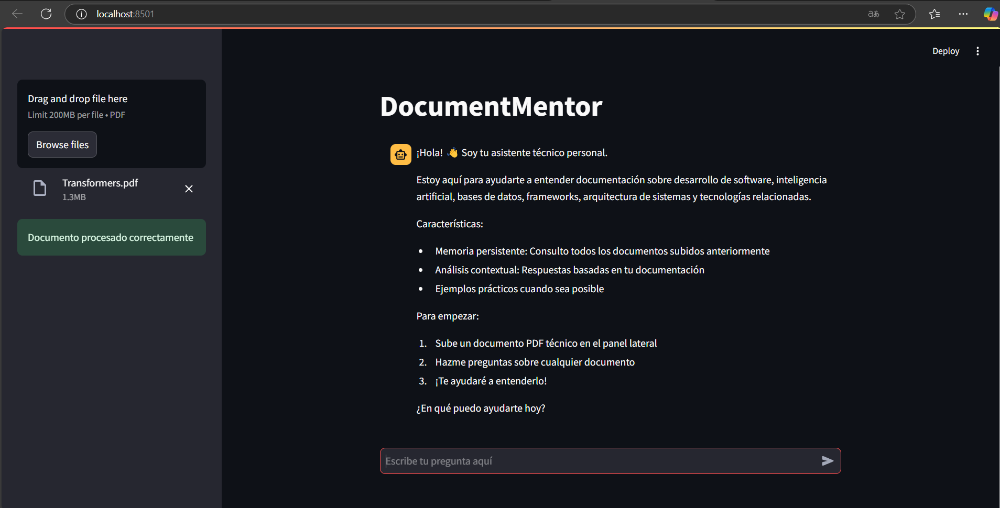

# DocumentMentor 📚



DocumentMentor es un sistema RAG (Retrieval Augmented Generation) que actúa como asistente de documentación técnica. Utilizando la arquitectura RAG, el sistema combina la potencia de GPT-3.5 de OpenAI con una base de conocimiento local para proporcionar respuestas precisas y contextualizadas sobre documentos técnicos en español.

## Tecnologías Principales 🛠️

- **LangChain**: Framework principal para la construcción del sistema RAG
  - Integración con OpenAI GPT-3.5
  - Cadenas de procesamiento personalizadas
  - Gestión de memoria conversacional
  - Prompts optimizados

- **OpenAI API**: 
  - Modelo GPT-3.5-turbo para generación de respuestas
  - Fine-tuning de prompts para contexto técnico
  - Respuestas en español natural

- **RAG (Retrieval Augmented Generation)**:
  - Embeddings locales con Sentence Transformers
  - Búsqueda semántica mediante FAISS
  - Recuperación contextual inteligente
  - Ampliación de conocimiento del LLM

## Estructura del Proyecto 📁

```
documentmentor/
├── data/                          # Datos y almacenamiento
│   ├── processed/                 # Documentos procesados
│   ├── vector_store/             # Almacenamiento vectorial
│   │   ├── document_map.json     # Mapeo de documentos
│   │   └── faiss.index          # Índice FAISS
│   └── documentmentor.db         # Base de datos SQLite
│
├── src/                          # Código fuente
│   ├── core/                     # Lógica principal
│   │   ├── __init__.py
│   │   ├── document_processor.py # Procesamiento de PDFs
│   │   ├── memory_manager.py     # Gestión de memoria
│   │   └── qa_engine.py         # Motor de Q&A
│   │
│   ├── data/                     # Capa de datos
│   │   ├── __init__.py
│   │   ├── database.py          # Operaciones SQLite
│   │   └── vector_store.py      # Gestión vectorial
│   │
│   └── ui/                       # Interfaz de usuario
│       └── app.py               # Aplicación Streamlit
│
├── .env                         # Variables de entorno
├── .env.example                 # Ejemplo de configuración
├── .gitignore
├── main.py                      # Punto de entrada
├── README.md
└── requirements.txt             # Dependencias
```

## Funcionamiento 🔄

### Procesamiento de Documentos 📄
1. **Carga de PDFs**:
   - Sube tus documentos técnicos en formato PDF
   - El sistema procesa automáticamente cada documento
   - Se extraen y segmentan los textos en chunks optimizados

2. **Indexación**:
   - Cada segmento se convierte en embeddings
   - Se almacenan en la base de datos vectorial FAISS
   - Se preservan los metadatos y referencias

### Flujo de Consultas 💭
1. **Preguntas del Usuario**:
   - Escribe tu pregunta en el chat
   - El sistema analiza la consulta
   - Se genera un embedding de la pregunta

2. **Búsqueda Semántica**:
   - Se buscan los segmentos más relevantes
   - Se utiliza FAISS para búsqueda eficiente
   - Se recupera el contexto más apropiado

3. **Generación de Respuestas**:
   - GPT-3.5 recibe el contexto relevante
   - Se genera una respuesta precisa
   - Se mantiene el contexto de la conversación

### Ejemplo de Uso 📝
1. **Preparación**:
   - Sube un manual técnico en PDF
   - Espera la confirmación de procesamiento
   - El documento está listo para consultas

2. **Consultas**:
   - Pregunta: "¿Qué requisitos tiene la instalación?"
   - El sistema busca secciones relevantes
   - Responde con información específica del documento

3. **Seguimiento**:
   - Puedes hacer preguntas de seguimiento
   - El sistema mantiene el contexto
   - Las respuestas son coherentes y relacionadas

### Ventajas 🌟
- Procesamiento local de documentos
- Respuestas basadas en tu documentación
- Contexto conversacional mantenido
- Búsqueda semántica precisa
- Interfaz intuitiva

## Requisitos 📋

```python
# Core LangChain dependencies
langchain==0.3.12
langchain-core==0.3.25
langchain-community==0.3.12
langchain-openai==0.2.12
openai==1.57.4

# Document Processing
pypdf==5.1.0
python-dotenv==1.0.1

# Vector Store & Embeddings
sentence-transformers==3.3.1
faiss-cpu==1.9.0.post1

# Database
SQLAlchemy==2.0.36

# UI Framework
streamlit==1.41.1

# Utils
numpy==2.2.0
pandas==2.2.3
pydantic==2.10.3
```

## Instalación 🔧

1. Clonar el repositorio
```bash
git clone https://github.com/Jaolmos/documentmentor-rag.git
```

2. Crear entorno virtual
```bash
python -m venv venv
```

3. Activar entorno virtual
```bash
# Windows
venv\Scripts\activate
# Linux/Mac
source venv/bin/activate
```

4. Instalar dependencias
```bash
pip install -r requirements.txt
```

5. Configurar variables de entorno
```bash
# Copiar el archivo de ejemplo
cp .env.example .env

# Editar el archivo .env usando .env.example como referencia
# y añadir tu API key de OpenAI
OPENAI_API_KEY=tu_api_key
```

## Uso 💡

1. Iniciar la aplicación
```bash
python main.py
```

El script `main.py` realiza las siguientes tareas:
- Carga variables de entorno desde `.env`
- Verifica la presencia de `OPENAI_API_KEY`
- Inicializa las carpetas necesarias:
  - `data/processed/` para documentos procesados
  - `data/vector_store/` para índices vectoriales
- Lanza la interfaz Streamlit

## Estado Actual 📊
- ✅ Procesamiento de documentos
- ✅ Sistema de embeddings local
- ✅ Búsqueda semántica
- ✅ Interfaz de usuario
- ✅ Gestión de memoria
- ✅ Persistencia de datos

## Notas Importantes ⚠️
- Requiere conexión a Internet para GPT-3.5
- Los documentos se procesan localmente
- Mantener actualizado el entorno virtual
- Revisar logs para diagnóstico
